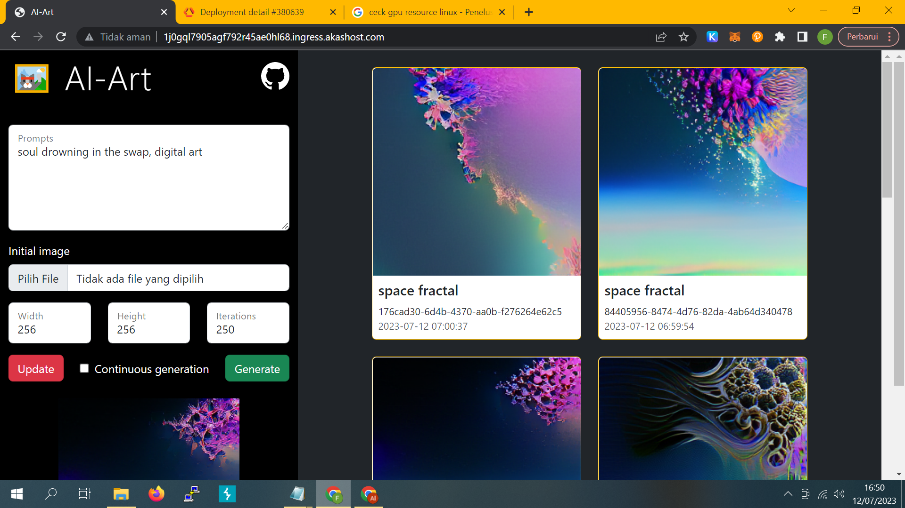
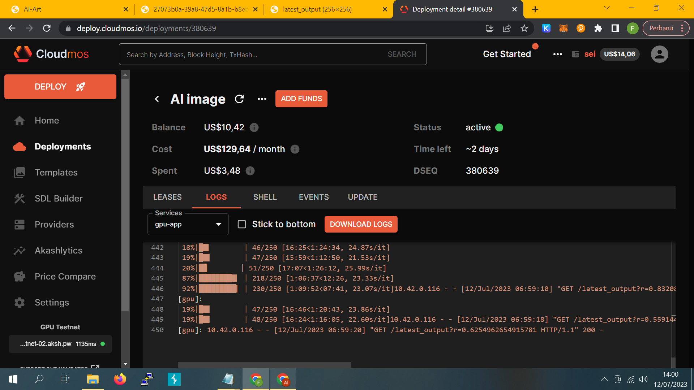
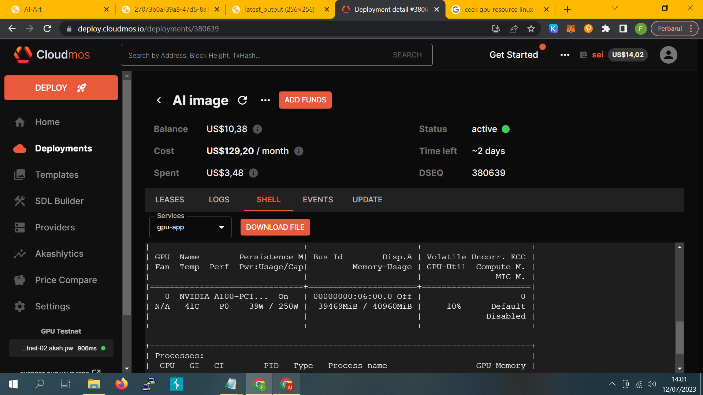

AI-Art utilizes VQGAN + CLIP within Docker containers to generate art. It simplifies art creation for users with GPUs through an easy-to-use web UI, expanding upon [Kevin Costa's original work](https://github.com/kcosta42/VQGAN-CLIP-Docker).

## Requirements

- Preferred: NVIDIA GPU
- Fallback: CPU mode (slower performance compared to GPU)

## Quick Start
Deploy SDL: Start the deployment process using the SDL [here](https://github.com/alfset/awesome-akash/blob/master/AI-Image-App/deploy.yaml).

## Monitor Logs: Watch the logs for model loading status and updates.

## GPU Resources

- 256x256 images: Requires 6 GB VRAM

- 512x512 images: Requires 12 GB VRAM

- 1024x1024 images: Requires 24 GB VRAM

Note: For non-square images, ensure total pixel count is within GPU VRAM limits. For example:

- 6 GB VRAM: Up to 384x128 or 128x384
- 12 GB VRAM: Up to 512x512
- 24 GB VRAM: Up to 1024x1024

Non-power of 2 dimensions are acceptable, e.g., 300x100.

## Checking GPU Resources
To check GPU usage and ensure optimal performance, refer to the logs and monitor GPU resource allocation.

